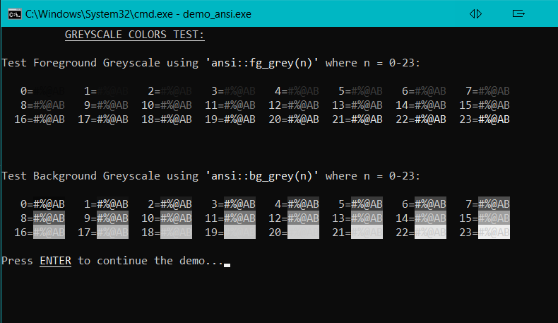
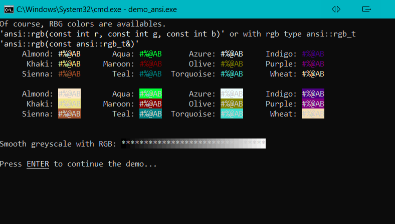
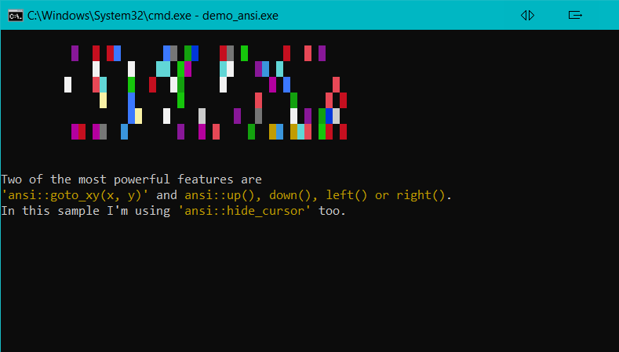

# Table of Contents

- [About The Project](#about-the-project)
- [Pros](#pros)
- [Cons](#cons)
- [Usage and Demo](#usage-and-demo)
- [License](#license)
- [Contact](#contact)

## About The Project

A simple way to show ansi colors and use escape codes on Linux and Windows terminals in a c++17 style with std::cout. .

## Pros

- Only one header.
- Multiplatform: Windows, Linux and UNIX.
- No external dependencies(*), like conio, ncurses, etc.

## Cons

- (*)On Windows you need to use Windows.h. The reason of that is a necessary hack with the API function SetConsoleMode(). On the other hand, that header and its dependencies are easily availables on Windows sytems.
- Colors and behaviors like blink text, may differ from system to system (xterm, tty, windows, kterm, etc.). The best way to deal with it is trial and error.
- Only for Windows 10 v1511 or higher.
- Not the best option if you are looking for performance.

## Usage and Demo

As easy as type somethink like <strong>std::cout \<\< ansi::yellow << \"Yellow text";</strong>.

Functions are doxygen style documented. Best way to learn is to have a look at the header file.

Run the demo to watch ansi codes in action. Some demo screenshots (in Windows):

## License

Distributed under the MIT License.

## Contact

Feel free to send me any feedback.

José Puga - josepuga.programacion@gmail.com
